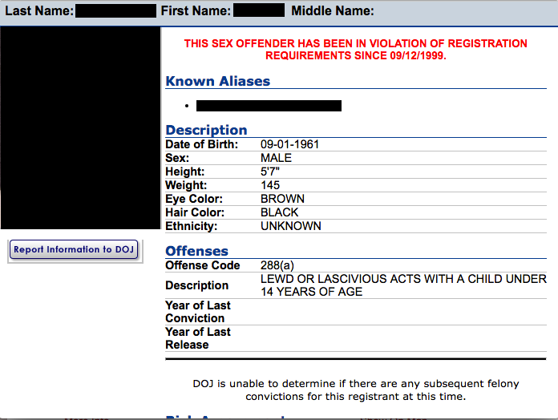
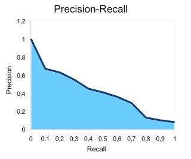
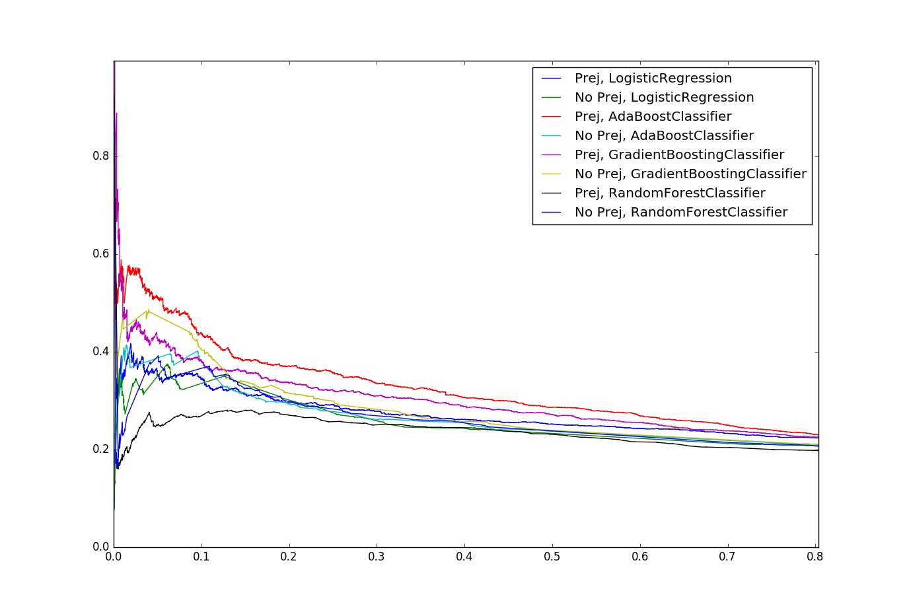
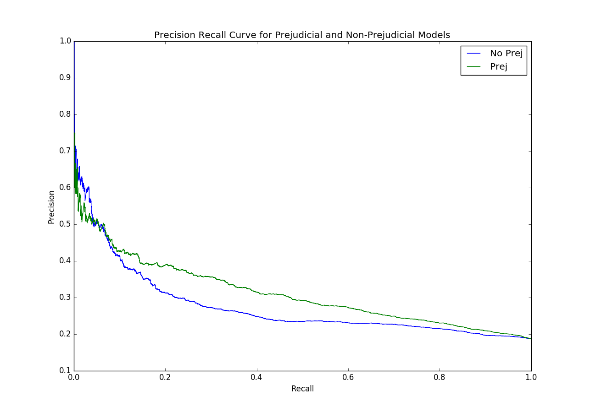
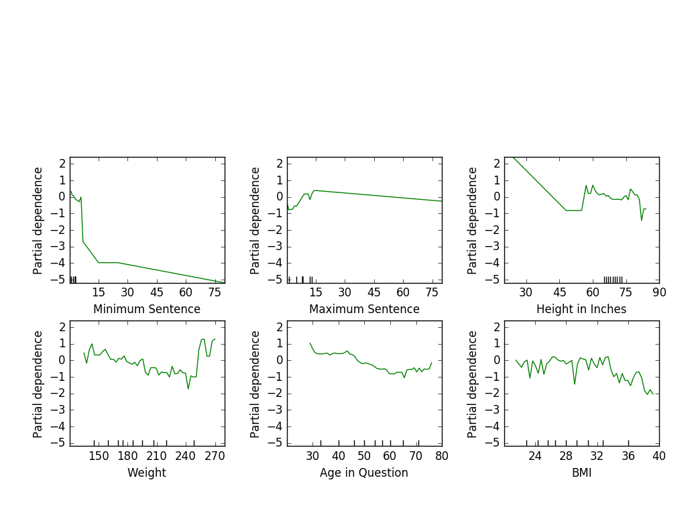
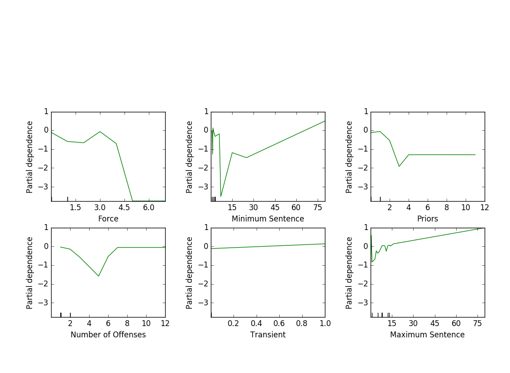

# Megan's Law SmartCatch
Applying data science and machine learning to predict whether a sex offender will violate the requirements of their registration and identifying risk factors.

## Important Topics

### Behavioral vs. Characteristic (Prejudicial)

In the field of crime prediction, profiling based on race, gender, and other physical characteristics is a controversial practice.  I set out to see if I could train a model that uses strictly behavioral features that performs as well as a model with high risk of prejudice.

## Context

California's Sex Offender Registry lists over 50,000 sex offenders.  They are required by law to register every month, every three months, or every year depending on their housing status and the crimes they committed.

## Process

I began by [scraping](data/webscraper) data from the Megan's Law website into a MongoDB database.  I cleaned my data, and then began engineering my features.

The data had two clear categories of information: descriptions of the offenders' physical characteristics and behavioral information pertaining to the crimes they committed.  I recognized that with these descriptive features I risked introducing sexism, racism, and other biases into my model, so I labeled them as prejudicial features and decided to compare the performance of models that did and did not include them.  Because it doesn't directly pertain to physical characteristics, I categorized transience as non-prejudicial.

I first considered recall as a scoring metric for my models because I wanted to  identify as many likely violators as possible.  Unfortunately, it was very easy for models to achieve high recall by predicting a violation far too often.  Instead of just recall, I evaluated my models by the area under the precision-recall curve.

## Outcomes

I set out to create a tool that the parole and probation systems could use to decide where they should focus their efforts.  I did so by training models that, depending on their decision threshold, can perform well at either precision or recall.

Out of the box, models performed better on average using the prejudiced features.  I selected the best performing classifier for each feature set, and when I grid searched over their hyper-parameters , I got these curves.

These models have two possible applications: punishment and assistance.  In the punitive category, imagine you want to put extra restrictions on or deny parole to someone with a high likelihood of violating.  In that case, you would probably want a model with high precision so that you could be more certain that you were punishing the right person.  When providing extra services or therapies, on the other hand, you might want to reach as many likely violators as possible.  In that case, you would prefer recall.  The non-prejudiced model best suits punitive purposes, while the prejudiced model performs better in the assistive realm.

These were the  features that my models found most important.  The prejudicial model believes that the older someone is and the higher their BMI, the less likely they are to violate.  The non-prejudiced model sees a positive correlation between violating and transience, which may have to do with the fact that transients need to register every month.

## Looking Forward

These models predict the risk of sex offenders violating the requirements of their registration.  In the mean time, to evaluate the risk of recidivism, California uses actuarial tools like this.

Despite being low-tech, these tools have decent ROC-AUC scores, but in the future I hope to show that their scores can be improved upon by introducing machine learning into the field.
